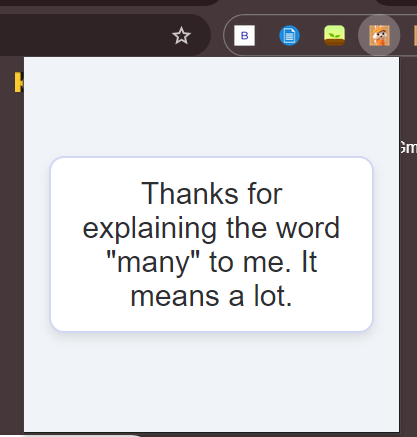

# Extension_Jokes

# Dad Jokes Chrome Extension

A simple and fun Chrome extension that displays random dad jokes. When you click the extension's icon, a random dad joke is fetched from the icanhazdadjoke API and displayed in a clean and user-friendly popup.

## Features

- Fetches random dad jokes from the [icanhazdadjoke](https://icanhazdadjoke.com/) API.
- Stylish and responsive popup design.
- Interactive hover effects and smooth transitions for an enhanced user experience.
- Lightweight and easy to use.

## Demo

### Screenshot
  <!-- Add your screenshot image here -->

## Installation

To get the Dad Jokes Chrome Extension running locally, follow these steps:

### 1. Clone the repository

```bash
git clone https://github.com/yourusername/dad-jokes-extension.git
2. Navigate into the project directory
bash
Copy code
cd dad-jokes-extension
